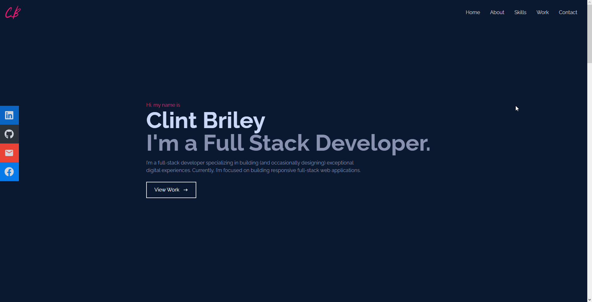
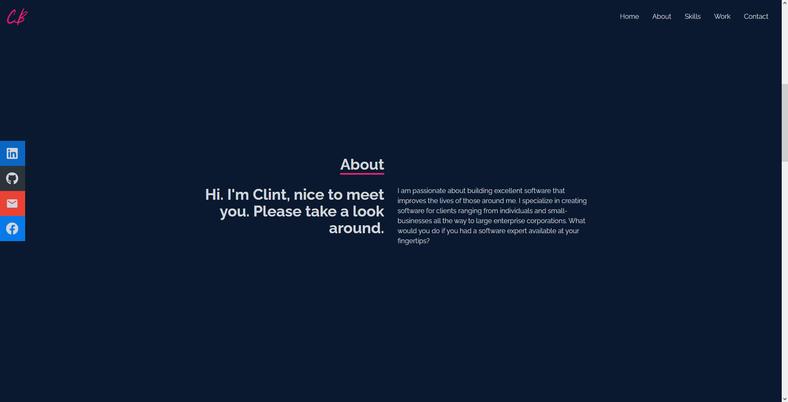
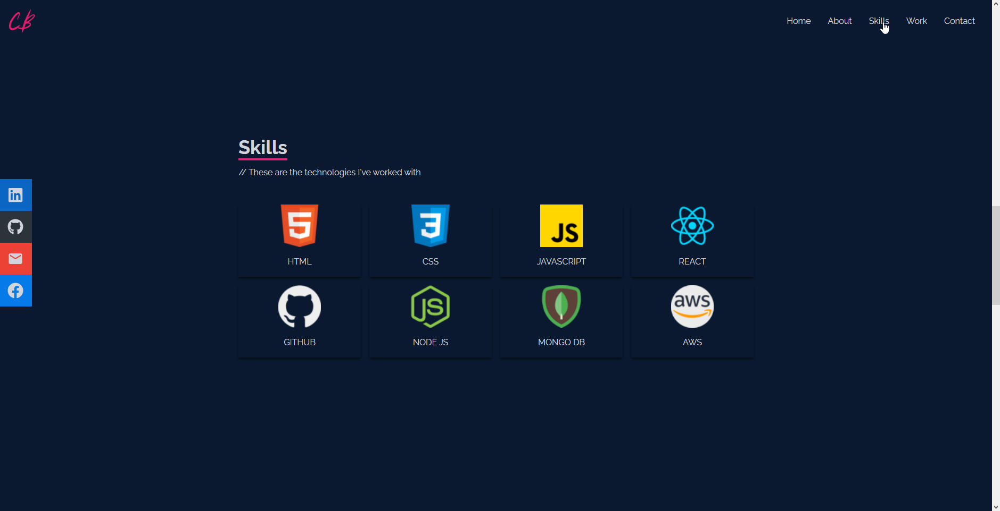
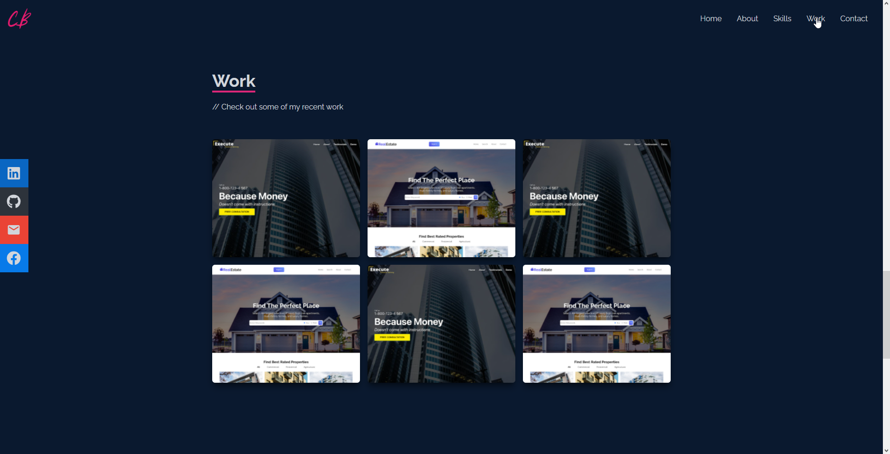
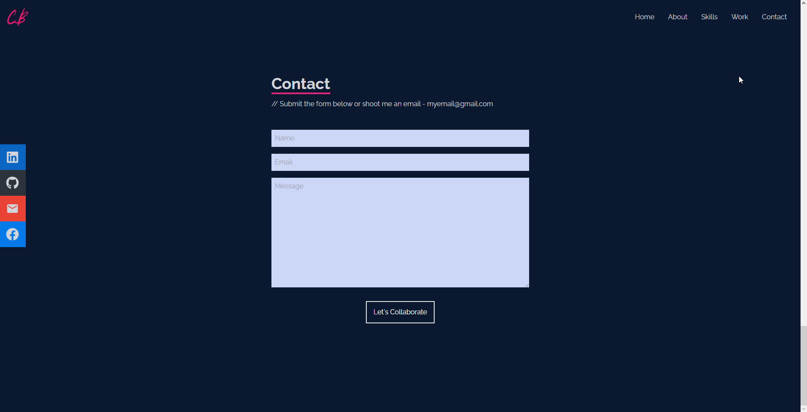

<div>
  
<div/>

<br/>

# Projeto : Portfólio com ReactJs e TailWindCSS

## 🔥 Objetivo

### Desenvolver a partir da aula do Clint Briley, [Build a React JS Website with Tailwind CSS - Beginner Tutorial Learning Tailwind CSS](https://www.youtube.com/watch?v=2kg0z1qNrkw), um portfólio responsivo utilizando ReactJS e TailWindCSS

<br/>

## 🖼️ Imagens do Projeto

<div>
  
  
  
  
  
<div/>

<br/>

## 📚 Bibliotecas

> TailWindCSS

```bash
npm install -D tailwindcss postcss autoprefixer
npx tailwindcss init -p
```

```javascript
// Inserir esse content no arquivo tailwind.config.js

module.exports = {
  content: [
    "./src/**/*.{js,jsx,ts,tsx}",
  ],
  theme: {
    extend: {},
  },
  plugins: [],
}
```

```CSS
/* Adicionar esse script dentro do arquivo  ./src/index.css */

@tailwind base;
@tailwind components;
@tailwind utilities;
```

> React Icons

```bash
yarn add react-icons
```

> React Scroll

```bash
yarn add react-scroll
```

<br/>

## 🔗 Links Úteis

* [Clint Briley - Code Commerce](https://www.youtube.com/watch?v=2kg0z1qNrkw)
* [TailWind CSS](https://tailwindcss.com)
* [React Icons](https://react-icons.github.io/react-icons/)
* [React Scroll](https://www.npmjs.com/package/react-scroll)
